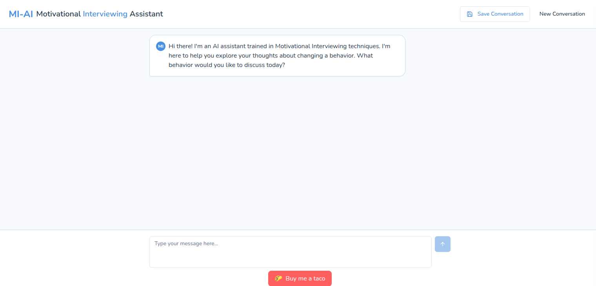

# MI-AI: Motivational Interviewing Assistant

An experimental AI chatbot that uses Motivational Interviewing (MI) techniques to help users explore behavior change. This project combines evidence-based MI practices with advanced AI to provide a supportive, conversational experience.

---

## 📚 Evidence-Based Practice

This project utilizes Motivational Interviewing methods based on [SAMHSA's TIP 35: Enhancing Motivation for Change in Substance Use Disorder Treatment](https://library.samhsa.gov/product/tip-35-enhancing-motivation-change-substance-use-disorder-treatment/pep19-02-01-003) (2019).

Motivational Interviewing is a collaborative, client-centered counseling style that helps individuals resolve ambivalence and strengthen motivation toward positive behavior changes.

---

## 🚀 Quickstart

To run MI-AI locally:

1. **Clone the repository**

   ```bash
   git clone https://github.com/[your-username]/mi-ai.git
   cd mi-ai
   ```

2. **Install dependencies**

   ```bash
   npm install
   ```

3. **Create your `.env` file**

   ```bash
   cp .env.example .env
   ```

   * Add your OpenAI API key in `.env`

4. **Start the development server**

   ```bash
   npm run dev
   ```

5. **Visit the app**

   ```
   Open http://localhost:5173
   ```

---

## 🌟 Features

* Natural and empathetic conversational style using MI techniques
* Dynamic assessment and responsive approach to user's readiness
* Strength-based interaction, emphasizing positive user attributes
* Secure handling of OpenAI API keys and session data
* No storage of personal conversation data

---

## 🔒 Privacy & Security

* Conversations remain confidential; no personal data is stored or retained.
* API keys are securely managed via environment variables.
* All conversation processing occurs client-side, protecting user privacy.

---

## 🛠️ Technical Stack

* React + TypeScript
* Vite
* TailwindCSS
* OpenAI GPT-4
* Deployment via Vercel

---

## 🎯 Purpose & User Benefits

This project explores the integration of evidence-based psychological techniques with conversational AI, aiming to:

* Make Motivational Interviewing accessible and engaging
* Support users in identifying and progressing through their stages of behavior change
* Provide actionable insights and motivational encouragement
* Serve as example of what can be accomplished with "vibe coding" in digital mental health.

---

## 🤝 Contributing

Contributions are welcome! To contribute:

* **Fork** the repository
* **Create** your feature branch (`git checkout -b feature/your-feature-name`)
* **Commit** your changes (`git commit -am 'Add new feature'`)
* **Push** to the branch (`git push origin feature/your-feature-name`)
* **Submit** a Pull Request

For issues, suggestions, or feedback, please open a GitHub issue. Ensure contributions adhere to best practices in documentation and code readability.

---

## 📷 Screenshots


*MI-AI's conversational interface demonstrating Motivational Interviewing techniques*

---

## 📝 License

This project is licensed under the MIT License. See the [LICENSE](LICENSE) file for details.
